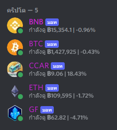

# Discord Bot CryptoCurrency / บอทแสดงค่าเงินพร้อมเปอร์เซ็นขึ้นลงในดิสคอร์ด

## Installation
- Creat bot discord
- Get bot token
- Get Coin API in https://www.coingecko.com/
- Edit .env
- Insert Coin API in COIN_ID_<code>&ast;</code>*currency_name*<code>&ast;</code>=[]
- Insert Bot token in *currency_name*_TOKEN=[]
- Edit index.js
- Add new Client bot
- Copy section // API for price *currency_name* and paste in async function getPrices()
- .......................
-
- Enjoy!

## What we use?
* Node.js

## TODO

* PWA - still waiting service worker is works on Safari
